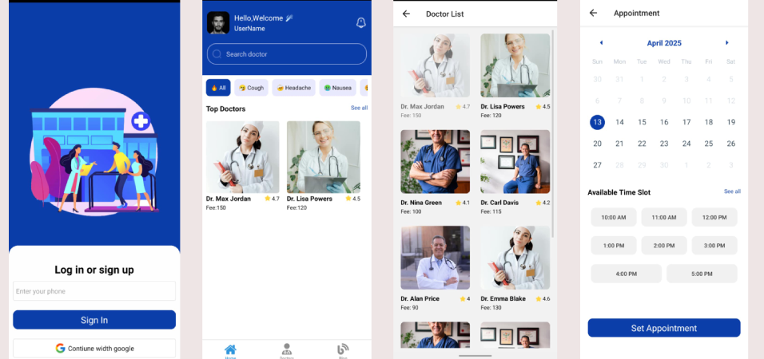

### Doctor Appointment App - React Native FullStack

 

 This Doctor Appointment and Booking System provides a seamless platform for users to find, book, and manage appointments with healthcare professionals. New users can easily register using the Sign-Up page, while returning users can securely log in to access their dashboard. Once logged in, users can browse and search for doctors by specialization, location, or availability. Each doctor profile includes detailed information such as qualifications, experience, ratings, and available time slots. Booking an appointment is simple—users select a date, time, and reason for visit, then confirm their booking. Upcoming appointments are visible on the dashboard, with options to reschedule or cancel. Users can also manage their personal profile and view booking history. The system ensures a user-friendly experience with real-time availability and confirmation notifications. It’s designed to streamline healthcare access by connecting patients with doctors efficiently, all while maintaining secure authentication and user data protection.
 https://gluestack.io/
